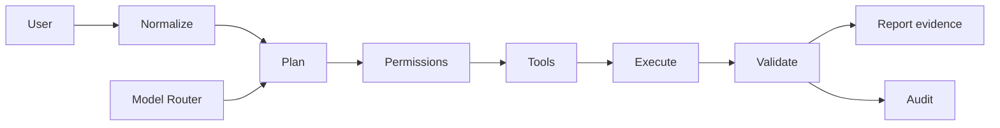

# ENMA — Personal AI Operating System

<details>
<summary><strong>⚡ Quick navigation</strong></summary>

**Explore:** [What it is](#what-it-is) · [Architecture](#architecture) · [Capabilities](#current-capabilities) · [Engineering evidence](#engineering-evidence) · [Security](#security-boundary) · [Run locally](#development)

</details>

ENMA is a local-first AI orchestration system designed around a simple principle:

> **AI should reason about work, but the system must execute, verify, and report what actually happened.**

It combines task planning, model routing, permissions, tools, memory, filesystem operations, auditability, and a Windows desktop shell into one extensible system.

## What ENMA is

ENMA is not intended to be a generic chatbot. Its architecture separates:

```
User request
    ↓
Task / intent normalization
    ↓
Execution planning
    ↓
Permission checks
    ↓
Tool execution
    ↓
Validation
    ↓
Audit
    ↓
Evidence-backed result
```

The system is designed so an AI-generated plan is not treated as proof that an operation succeeded.

## Core engineering principles

- **Evidence over claims** — execution results determine status.
- **Human authority** — sensitive actions require explicit permission.
- **Fail closed** — unknown or unsafe conditions do not silently fall through.
- **Provider agnostic** — model providers are behind a common routing layer.
- **Auditable execution** — important actions and provider attempts are recorded with secret-safe metadata.
- **Local first** — the desktop application owns the local execution boundary.
- **Truthful failure** — inability to verify an operation is reported instead of being presented as success.

## Current capabilities

### Task execution

- Task planning and execution
- Dependency-aware task steps
- Cooperative cancellation
- Approval / deny workflow
- Failed-dependency blocking
- Persistence and recovery
- Async execution boundary for synchronous tools
- Filesystem operations with post-write verification

### AI model routing

ENMA uses a provider abstraction rather than coupling the application to one model vendor.

The router supports explicit provider selection and controlled fallback. Automatic fallback is limited to transient failures such as rate limits, timeouts, network failures, provider unavailability, and model unavailability. Authentication failures, invalid requests, and unknown failures stop instead of being blindly retried elsewhere.

### Tools and permissions

The system includes a centralized tool registry and permission policy layer.

Sensitive filesystem operations are guarded, and secret/configuration files are protected from unintended reads. Tool execution is designed to remain observable and auditable.

### Memory and retrieval

ENMA includes persistent memory and document/retrieval capabilities with graceful degradation when optional ML dependencies are unavailable. The application does not fabricate embeddings when the ML layer cannot load.

### Desktop application

The Windows desktop shell uses Electron and packages the existing React frontend together with the FastAPI backend and runtime.

```
Electron desktop shell
        │
        ├── React / Vite frontend
        │
        └── FastAPI backend
                │
                ├── Task system
                ├── Model router
                ├── Tools
                ├── Permissions
                ├── Memory
                └── Audit
```

The desktop packaging path includes configuration reconciliation and backend-process management rather than simply wrapping a development server.

## Engineering focus

ENMA has been used to work through real reliability problems including:

- provider fallback semantics
- authentication-vs-transient failure handling
- task cancellation
- dependency propagation
- truthful filesystem verification
- configuration upgrades without overwriting credentials
- desktop backend port detection
- packaged backend lifecycle
- optional ML dependency isolation
- secret-safe audit metadata
- Windows desktop packaging

The repository intentionally documents limitations and deferred work instead of presenting unfinished capabilities as complete.

## Repository structure

```
backend/
  api/
  core/
  analyzer/
  diagnostics/
  fix_engine/
  runtimes/
  validation/
  knowledge/
  sandbox/
  providers/

frontend/
desktop/
docs/
tests/
infrastructure/
```

## Development

### Backend

```bat
python -m venv .venv
.venv\\Scripts\\pip install -r requirements.txt
.venv\\Scripts\\uvicorn backend.main:app --host 127.0.0.1 --port 8000
```

### Frontend

```bat
cd frontend
npm install
npm run dev
```

### Tests

Backend tests:

```bat
python -m pytest
```

Desktop tests:

```bat
cd desktop
npm test
```

Frontend production build:

```bat
cd frontend
npm run build
```

## Security boundary

ENMA executes local operations, so execution is treated as a security-sensitive capability.

The project includes permission checks, secret-file protections, cancellation, audit records, and verification boundaries. Production deployments should still be reviewed according to the capabilities and trust model enabled by the operator.

Never commit local secrets or credential-bearing configuration files.

## Project status

ENMA is an actively developed engineering project. The Windows desktop application, task system, model routing, permissions, tools, persistence, audit, and verification layers are implemented incrementally and tested as separate boundaries.

Some capabilities remain intentionally deferred rather than represented as complete.

## Direction

The long-term direction is an extensible personal AI operating system where specialized capabilities can be added without coupling the core runtime to one model provider or one task type.

Potential future extensions include additional skills, richer execution specifications, repository-level development workflows, and specialized capabilities such as quantum software debugging.

---

**Built with:** Python · FastAPI · React · Vite · Electron · SQLite · pytest


<details>
<summary><strong>👀 Reading this repository</strong></summary>

If you have only one minute, read the opening principle, then inspect the architecture and verification/testing sections. The project is intentionally documented around **what the system can demonstrate**, not what it is intended to become.

</details>

<details>
<summary><strong>🧠 Interactive architecture map</strong></summary>



The key idea is that **reasoning, execution, validation, and audit are separate boundaries**.

</details>
